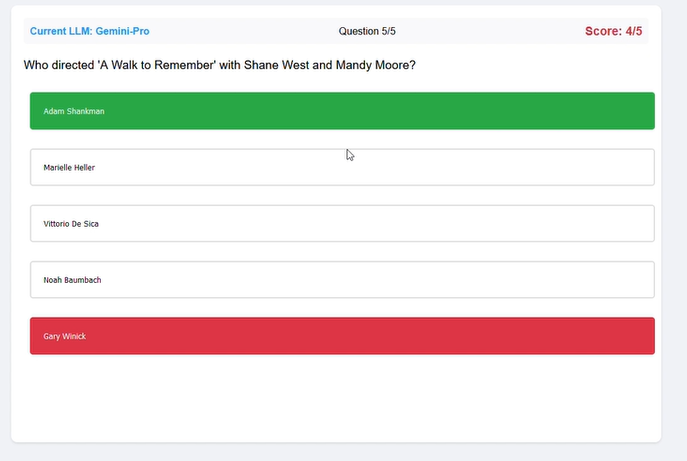

# LLM Movie Quiz Battle 🎬 🤖 🎯

Watch three AI titans battle it out in the ultimate movie trivia showdown! GPT-4, Claude-3, and Gemini Pro compete head-to-head, answering challenging movie questions in real-time.



## ✨ Key Features

- **Live AI Competition** 
  - Watch three leading LLMs compete simultaneously
  - Real-time answer selection with visual feedback
  - Dynamic score tracking with color changes
  - Stop/Reset functionality at any time

- **Interactive Display**
  - Yellow highlight: Initial AI selection
  - Green: Correct answers
  - Red: Incorrect answers
  - Color-changing score based on accuracy

- **Detailed Analytics**
  - Accuracy percentages
  - Response timing
  - Confidence scoring
  - Final performance comparison

## 🚀 Quick Start

### Prerequisites

```bash
# Required software
Node.js v14+
Python 3.x
npm or yarn

# API Keys needed
OpenAI API key (for GPT-4)
Anthropic API key (for Claude-3)
Google AI API key (for Gemini Pro)
```

### Setup

1. **Clone & Install**
```bash
git clone https://github.com/michaelkernaghan/movie-quiz-game
cd movie-quiz-game
cd src/backend
npm install
```

2. **Configure Environment**
```bash
# Create .env file in src/backend
cp .env.example .env
# Edit .env with your API keys
```

3. **Launch**
```bash
./restart-servers.sh
```

4. **Access**
- Open http://localhost:8000 in your browser
- Backend runs on http://localhost:3000

## 🎮 Gameplay

1. **Start Screen**
   - Shows number of questions per LLM
   - Total questions in competition
   - Start button to begin

2. **Competition Flow**
   - Each LLM answers the same questions
   - Watch real-time decision making
   - See immediate feedback on answers
   - Track scores and progress

3. **Results Dashboard**
   - Comprehensive statistics
   - Performance comparisons
   - Response time analysis
   - Confidence level tracking

## ⚙️ Configuration

Customize the experience in `src/backend/config.js`:
```javascript
{
    questionsPerRound: 10,    // Questions per LLM
    questionTimeout: 10000,   // Max response time (ms)
    showAnswerDelay: 3000,   // Display time per answer (ms)
    llms: ['GPT-4', 'Claude-3', 'Gemini-Pro']
}
```

## 🔧 Technical Architecture

### Frontend
- Vanilla JavaScript (no frameworks)
- CSS3 animations and transitions
- Responsive design principles
- Real-time state management

### Backend
- Node.js/Express server
- RESTful API endpoints
- LLM API integrations
- Error handling & timeouts

## 🔐 Security Notes

- Never commit API keys
- Add `.env` to `.gitignore`
- Implement rate limiting
- Handle API failures gracefully

## 📈 Performance Tips

- Adjust timeouts based on API response times
- Monitor API usage and costs
- Cache responses when possible
- Handle network failures gracefully

## 🤝 Contributing

We welcome contributions! Please see our [Contributing Guidelines](CONTRIBUTING.md) for:
- Code style
- Pull request process
- Development setup
- Testing requirements

## 🐛 Troubleshooting

Common issues and solutions:
1. API key errors: Verify `.env` file setup
2. Server connection: Check ports 3000/8000 availability
3. Python version: Ensure Python 3.x is used
4. Node modules: Run `npm install` if modules missing

## 📝 License

MIT License - See [LICENSE](LICENSE) for details

## 📧 Contact & Support

- Creator: Michael Kernaghan
- GitHub: [@michaelkernaghan](https://github.com/michaelkernaghan)
- Issues: [GitHub Issues](https://github.com/michaelkernaghan/movie-quiz-game/issues)

## 🙏 Acknowledgments

- OpenAI, Anthropic, and Google AI teams
- Movie trivia contributors
- Open source community
- Decentralized Pictures

